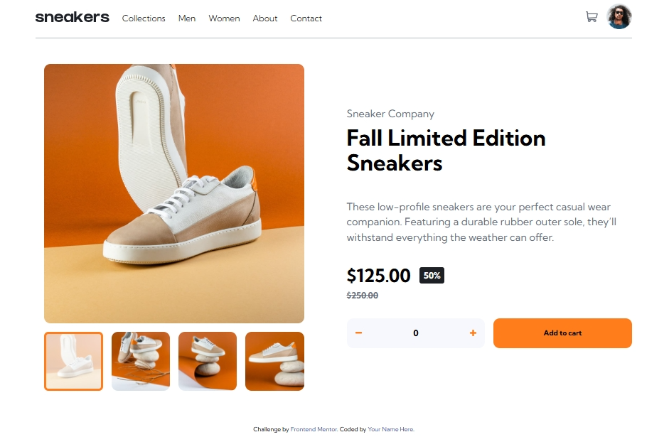

# Frontend Mentor - E-commerce product page solution

This is a solution to the [E-commerce product page challenge on Frontend Mentor](https://www.frontendmentor.io/challenges/ecommerce-product-page-UPsZ9MJp6). Frontend Mentor challenges help you improve your coding skills by building realistic projects.

## Table of contents

- [Overview](#overview)
  - [The challenge](#the-challenge)
  - [Screenshot](#screenshot)
  - [Links](#links)
- [My process](#my-process)
  - [Built with](#built-with)
  - [What I learned](#what-i-learned)
  - [Continued development](#continued-development)
- [Author](#author)


## Overview

### The challenge

Users should be able to:

- View the optimal layout for the site depending on their device's screen size
- See hover states for all interactive elements on the page
- Open a lightbox gallery by clicking on the large product image
- Switch the large product image by clicking on the small thumbnail images
- Add items to the cart
- View the cart and remove items from it

### Screenshot




### Links

- Solution URL: [Add solution URL here](https://github.com/dimitrisdr/e-commerce-product-page.git)
- Live Site URL: [Add live site URL here]( https://dimitrisdr.github.io/e-commerce-product-page/)

## My process

### Built with

- Semantic HTML5 markup
- CSS custom properties
- Flexbox
- CSS Grid
- Mobile-first workflow

### What I learned


```html
  <article class="lightbox-container" aria-label="lightbox" aria-hidden="true">
    <div class="lightbox">
      <button class="btn x-mark-icon-btn">
        <svg width="14" height="15" xmlns="http://www.w3.org/2000/svg"><path d="m11.596.782 2.122 2.122L9.12 7.499l4.597 4.597-2.122 2.122L7 9.62l-4.595 4.597-2.122-2.122L4.878 7.5.282 2.904 2.404.782l4.595 4.596L11.596.782Z" fill="#ffffff" fill-rule="evenodd"/></svg>
      </button>
    </div>
  </article>
```
```css
.cart-container {
    background-color: var(--White);
    width: calc(100% - 1rem);
    position: absolute;
    top: calc(3 * var(--global-padding));
    left:50%;
    transform: translate(-50%, 0);
    z-index: 100;
}
```
```js
const mediaThresshold = 781;
const matchMediaQueryWidth = window.matchMedia(`(max-width:${mediaThresshold}px)`)


const handleMediaQueryChange = (e) => {
    if (e.matches) {
        lightBoxContainer.setAttribute('aria-hidden', 'true')
        if (mainImg.children[0].getAttribute('src') !== startMainImgSrc ) {
            mainImg.children[0].setAttribute('src', startMainImgSrc)
        }
    }else {
        if (smallerImagesContainer[0].getAttribute('data-active') !== 'true') {
            smallerImagesContainer.forEach(c => {if (c.getAttribute('data-active') === 'true'){
            c.setAttribute('data-active', 'false')
           }})
           smallerImagesContainer[0].setAttribute('data-active', 'true') 
        }
    }
}
```

## Author

- Website - [Add your name here](https://www.your-site.com)
- Frontend Mentor - [@yourusername](https://www.frontendmentor.io/profile/dimitrisdr)
